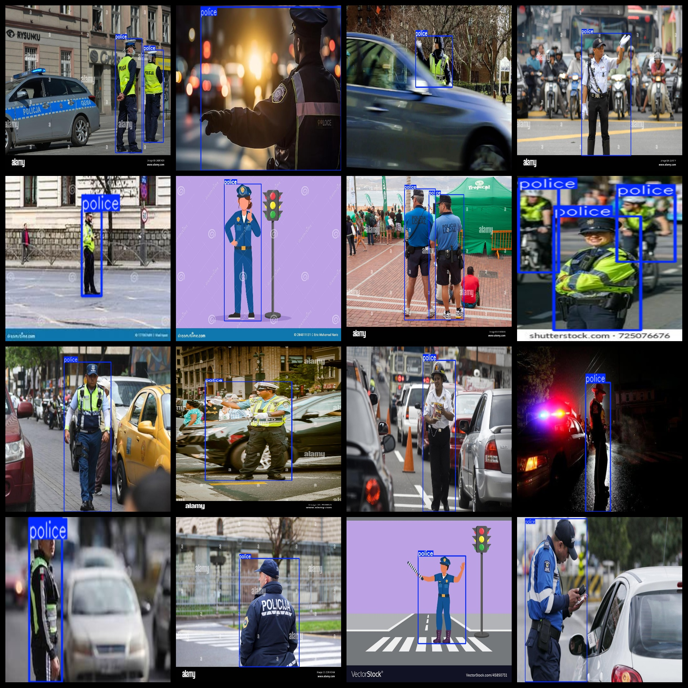
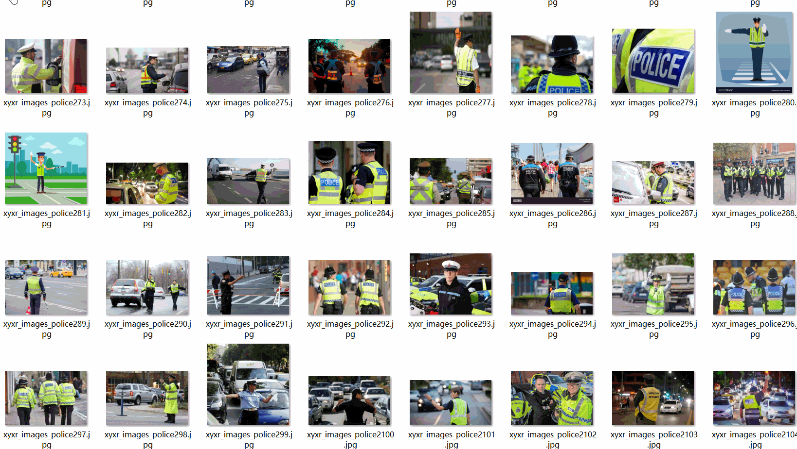

# Traffic Police Detection Dataset 1815 images VOC+YOLO format

The traffic police detection dataset consists of 1815 images in VOC+YOLO format.

The dataset is formatted with VOC and YOLO, and includes three folders for storing images, xml files, and text files respectively.

The JPEGImages folder contains a total of 1815 jpg images.

The Annotations folder includes a total of 1815 xml files.

The labels folder contains a total of 1815 text files.

There are a total of 1 label type: "police".

Each labeled image has 2471 bounding box (box) numbers.

The total number of boxes is 2471.

The image resolution is clear (pixel).

The images have not been enhanced.

The GitHub repository location is datasets_sl.

The label shape is a rectangular box used for target detection recognition.

Important Notes: There is no zero-5.

Special Remarks: This dataset does not guarantee the accuracy or file weight of the trained models or weights. The dataset provides accurate and reasonable annotations only.

The annotation and image situation is as follows:

## Images

---

Here is a pay link on Stripe (https://buy.stripe.com/3cs8yP7sY87d0vu9AB). Please contact me lonlonago@foxmail.com after funding $89, and I will send you a complete data files, thank you!

